# Python

상위폴더로 이동

거기에서 add하고 commit 해줌

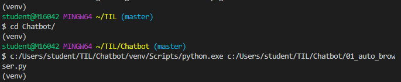

파일을 새로 만들어줌

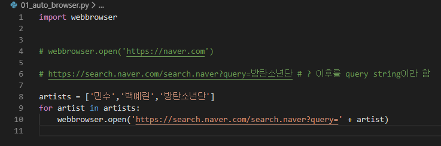

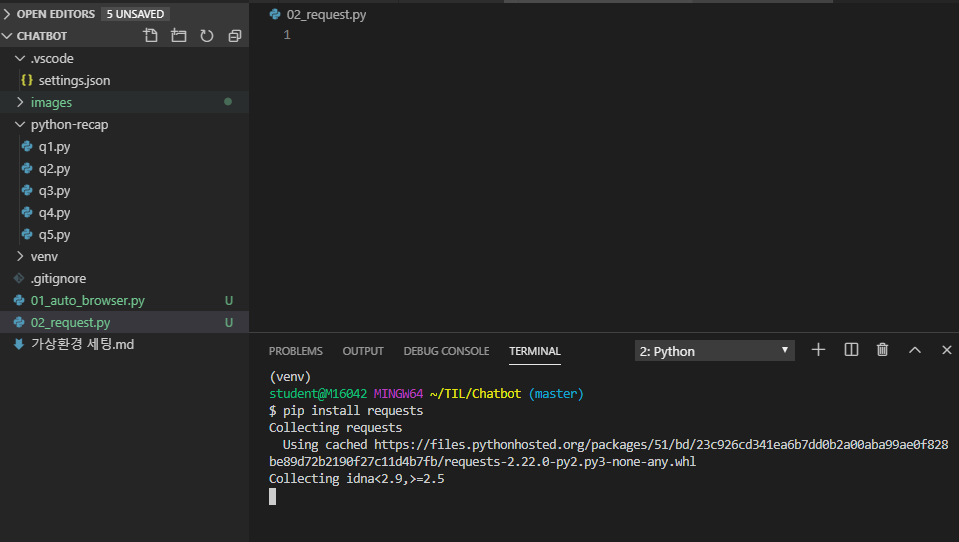

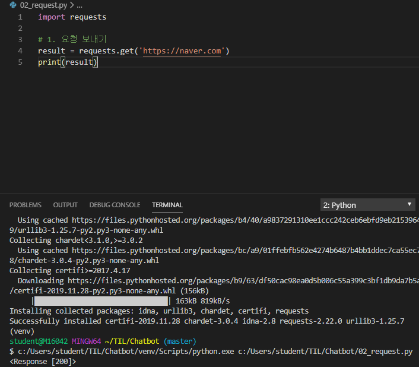

<response[200]> 결과값을 이리저리 가공해볼 수 있는 객체

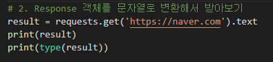

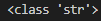

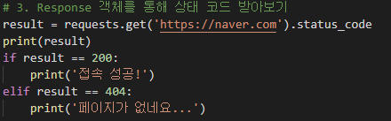

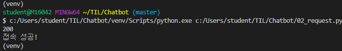

상태 코드 필요한 이유 : 언어가 통하지 않는 곳에서도 알아볼 수 있어

http 상태 코드 : 200정상접속, 404..

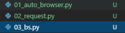

스크래핑

beautifulsoup4

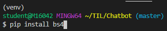

[네이버금융](https://finance.naver.com/sise/)

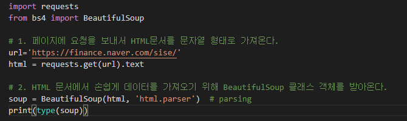

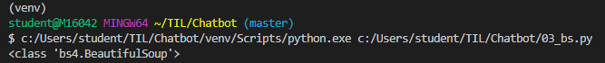

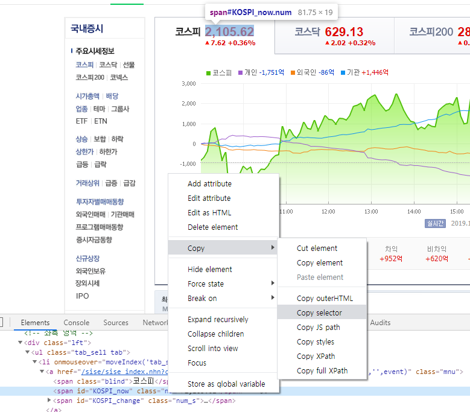

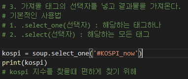

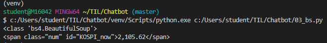

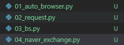

[네이버 시장지표](https://finance.naver.com/marketindex/)

달러 환율을 들고 오려고 한다

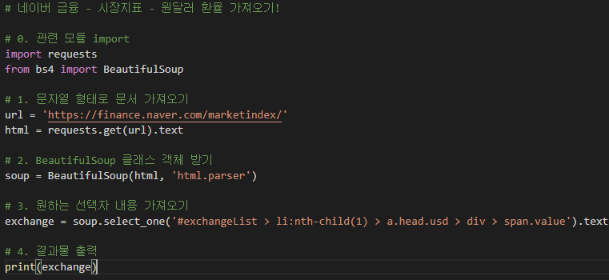

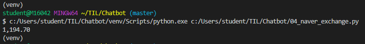

검색어를 뽑아볼거야! 1~10위까지

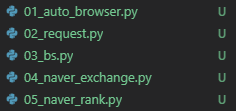

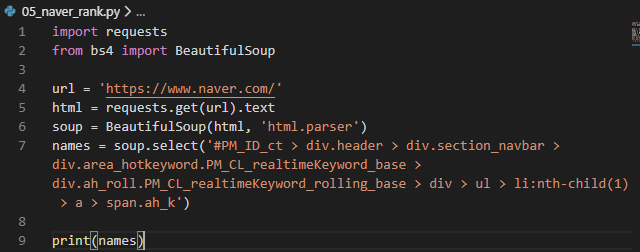

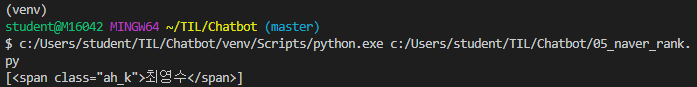

한꺼번에 다뽑게 바꾸려고 한다

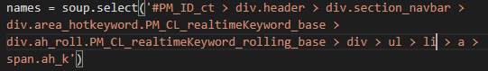

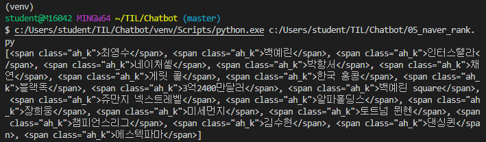

for문 돌려서 텍스트만 꺼낼거야

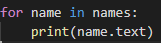

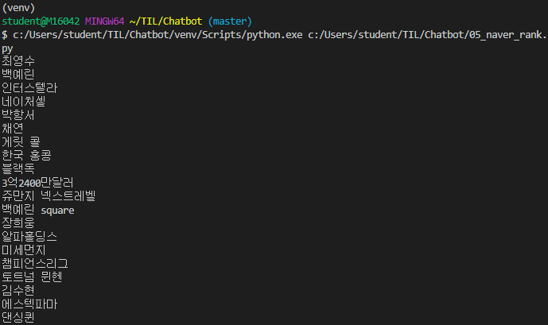