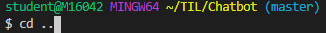
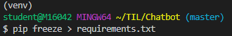
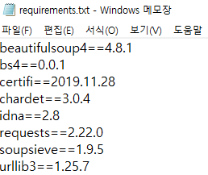
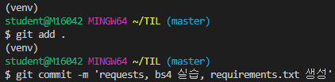
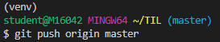

# 가상환경 세팅

바탕화면에서 gitbash

파이썬 버전 확인

[파이썬 다운로드](https://www.python.org/)

*path 추가 꼭 해줘야해!*

새로운 가상환경만들거야

ctrl+shift+p

ctrl+`

여기에서만 쓸 가상환경을 만들거야

venv : 'venv'이라는 가상환경을 만들겠다

가상환경 폴더가 만들어짐

진입할때 

venv -> script

(venv)가 생김

이코드 비쥬얼 스튜디오 들어올때 바로 치게 할거야

기본적으로 적용될 가상환경을 설정해서 이명령어 치게 할거야

ctrl+shift+p

ctrl+`

자동으로 쳐지게 됨

보면 이렇게 되어있어

가상환경 탈출

[gitignore](https://www.gitignore.io/)

복사해서

vim을 써보자

i 눌러서 붙여넣기

이렇게 폴더 생길거야

노란색 없애주기 위해 업데이트

가상환경 세팅 끝!!!!

---

# 가상환경 옮길때

우리가 다 입력하고 다른거 작업한 후 venv폴더에서 명단만 넘겨주고 설치하게 시켜야해

어떤 패키지들이 깔려있는지 파일 만들어줌

push 해줘야해

