# Git 추가 설명

## 1. commit

> commit을 통해 이력을 확정하면 hash값이 부여되며, 이 값을 통해 동일한 커밋인지를 확인한다

```bash
commit f3889bb50911b7ee0814425d03f9317d1e30dab9
```

```bash
commit e376db14e52807011a4e63adb988a17c33b52395
Author: youngflowey <freshnsy@gmail.com>
Date:   Tue Dec 10 14:35:24 2019 +0900
:    # 가끔 이렇게 뜨는데 q를 눌러주면 돼
```

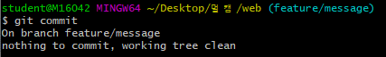

커밋할 수 없고 작업하는 것도 없다

커밋하는 상황 : 작업 파일이 있을때

```bash
# WD 변화 X, staging area 변화 X
# 변경사항 X
$ git commit
On branch feature/message
nothing to commit, working tree clean
```

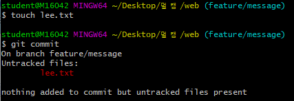

```bash
# WD 변화 O, staging area 비어있을 때
$ git commit
On branch feature/message
Untracked files:
        lee.txt

nothing added to commit but untracked files present
```

이거 커밋하고 싶으면 add  해

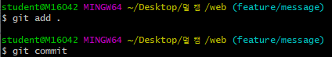


### commit 메시지 작성하기

> 부제 : vim 활용법

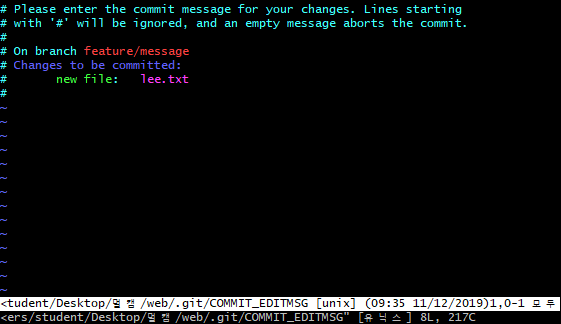

```bash
$ git commit
```

* 편집모드(i)

  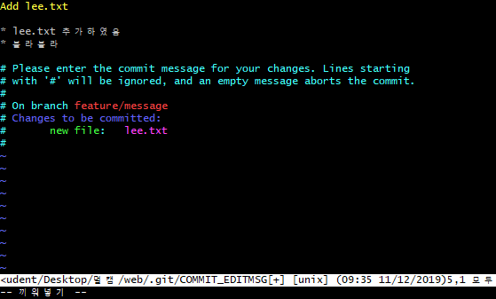

* 명령모드(esc)

  * dd : 해당 줄 삭제
  * `:wq`: 저장 및 종류
    * w : write(저장)
    * q : quit(종료)
  * `:q!` : 강제종료
    * q : quit
    * ! : 강제

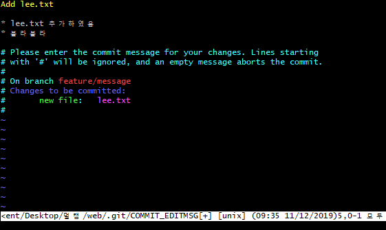

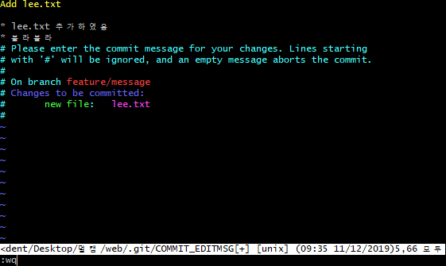

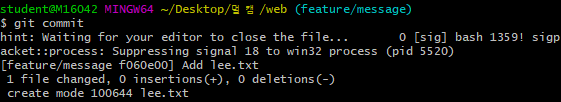

### log 활용하기

```bash
$ git log
$ git log --oneline
$ git log -l
$ git log -l --oneline
$ git log --oneline --graph
```

* HEAD : 현재 작업하고 있는 커밋 이력 및 브랜치에 대한 포인터

```bash
f060e00 (HEAD -> master) Add lee.txt
# 나는 현재 master 브랜치에 있고,
# f060e00 커밋의 상태에 있다.
```

* 예시)

```bash
$ git log --oneline
f060e00 (HEAD -> master) Add lee.txt
b4c1dc3 (feature/signout) complete signout
63a1c7e (origin/master) 집 - main.html

# 나는 master 브랜치에서 f060e00 커밋을 했고,
# feature/signout 브랜치는 b4c1dc3 이력이고,
# 원격저장소(origin/master)는 63a1c7e 이력이다.
```

### 직전 커밋 메시지 수정

> 아래의 명령어는 **커밋 이력을 변경**하기 때문에 조심해야 한다.
>
> 공개된 저장소에(원격저장소) 이미 push된 이력이라면 절대 해서는 안된다.

```bash
# 수정전
$ git log --oneline -1
f060e00 (HEAD -> master) Add lee.txt

# 수정
$ git commit --amend
```

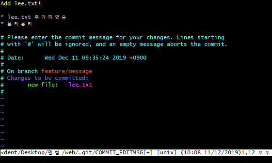

```bash
# 수정후
$ git log --oneline -1
b36b972 (HEAD -> master) Add lee.txt!
```

### 커밋시 특정 파일을 빠뜨렸을 때

만약, staging area에 특정 파일(`omit_file.txt`)을 올리지 않아서 커밋이 되지 않았을 때!

```bash
$ git add omit_file.txt
$ git commit --amend
# 시점을 살짝 돌려줌 지금 상태 그대로 가지고 있는 상태에서 커밋을 입력할때로 돌아감
```

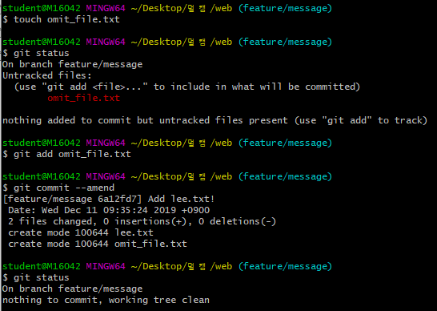

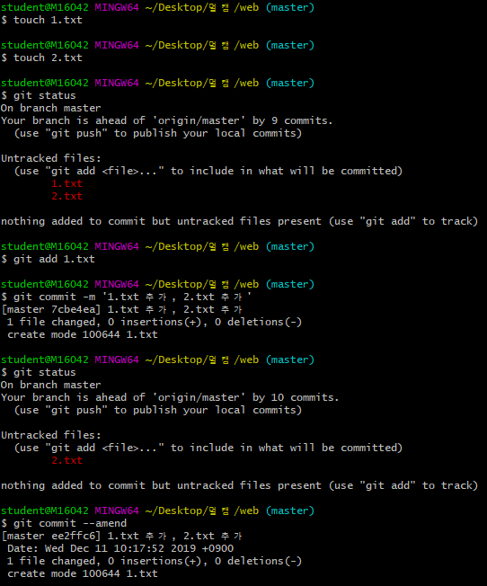

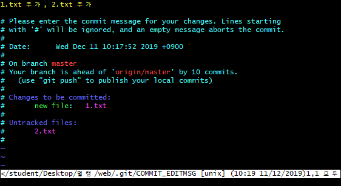

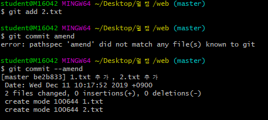


## 2. staging area

* 커밋 이력이 있는 파일 수정한 경우

```bash
$ git status
On branch master   # master 브랜치에 있다.

Changes not staged for commit: # 변경사항들, stage 안된(커밋을 위한)
							   # staged가 아닌 변경사항들
	# 커밋이 되기 위해서 -> staged로 바꾸려면 
  (use "git add <file>..." to update what will be committed)
  	# WD에 있는 변화를 버리려면 -> 고양이
  	# (커밋 이후에 변경된 사항을 모두 없애버림)
  (use "git restore <file>..." to discard changes in working directory)
        modified:   2.txt
# staging area가 비어있습니다!
# (커밋에 추가될 변화가 없다.)

no changes added to commit (use "git add" and/or "git commit -a")
											# git add . & commit 둘다
											# 뒤에 바로 메세지 쓰면 돼
```

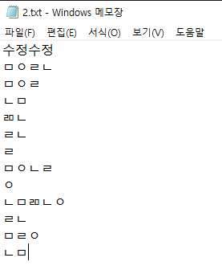

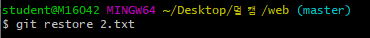

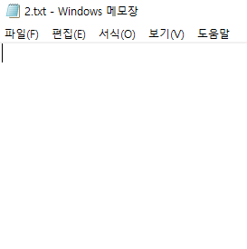

restore : 커밋이후로 발생한 변화분을 다 지워버리는 것

```bash
$ git status
On branch master
# 커밋이 될 변화
# (커밋 명령어 했을 때, 아래의 내용이 이력에 남는다.)
Changes to be committed:
	# unstage 하기 위해서 (add의 반대 작업)
  (use "git restore --staged <file>..." to unstage)
        modified:   2.txt
```

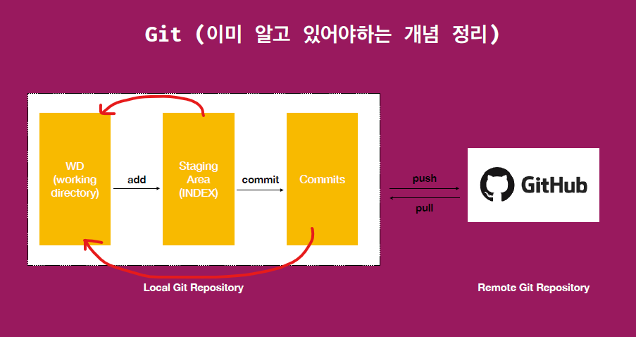

add를 반대로 하는 작업

* 커밋 이력이 없는 파일인 경우

```bash
$ git status
On branch master
# tracking 되고 있지 않는 파일 -> commit(이력)에 한번도 관리된적 없다.

Untracked files:
  (use "git add <file>..." to include in what will be committed)
        jinsoo.txt
# 커밋할 것도 없고(staging area가 비어있고),
# 트래킹 되고 있지 않는 파일도 있다.
nothing added to commit but untracked files present (use "git add" to track)
```

###  `add` 취소하기

```bash
$ git restore --staged <file>
```

* 구버전 git에서는 아래의 명령어로 사용해야 한다.

```bash
$ git reset HEAD <file>
```

### Working directory 변화 삭제하기

> git에서는 모든 commit된 내용은 되돌릴 수 있다.
>
> 다만, 아래의 WD 내용을 삭제하는 것은 되돌릴 수 없다.

```bash
$ git restore <file>
```

* 구버전에서는 아래의 명령어를 사용해야 한다.

```bash
$ git checkout -- <file>
```

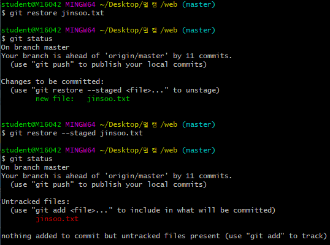

til이 하나의 저장소인데 저장소 안에 저장소에서 git init 으로 저장소를 더 만들면 안된다


## Stash

> Stash는 변경사항을 임시로 저장해놓은 공간이다.

### 예시 상황

```bash
1. test branch에서 a.txt를 변경 후 커밋
2. master branch에서 a.txt를 수정!(add / commit X)
3. merge
```

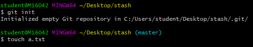

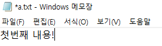

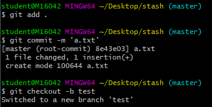

테스트 브랜치 만듦

파일을 수정해보자

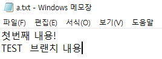

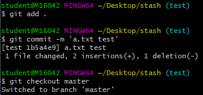

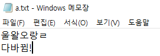

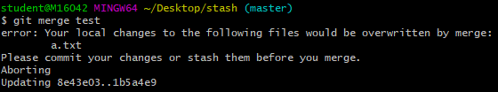


```bash
$ git merge test
# 현재  merge 명령어로 인해 아래의 파일이 덮어쓰여질 수 있다.
error: Your local changes to the following files would be overwritten by merge:
        a.txt
# commit을 하거나 -> 이력 확정을 해서 merge시 충돌 나는 상황이 될것
# stash 해라 -> Working Directory 를 잠시 비워놓음.
Please commit your changes or stash them before you merge.
Aborting
Updating 8e43e03..1b5a4e9
```

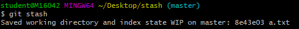

stash : 임시저장공간에 변경사항들을 맡겨놓음, 잠시 임시보관해놓음

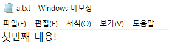


```bash
$ git stash		# stash 공간에 저장
Saved working directory and index state WIP on master: 8e43e03 a.txt

$ git stash list  # stash 공간 내용 확인(목록)
stash@{0}: WIP on master: 8e43e03 a.txt

$ git stash pop   # stash 공간에서 적용(apply)하고 목록에서 삭제(drop)하기
On branch master
Changes not staged for commit:
  (use "git add <file>..." to update what will be committed)
  (use "git restore <file>..." to discard changes in working directory)
        modified:   a.txt

no changes added to commit (use "git add" and/or "git commit -a")
Dropped refs/stash@{0} (1978e6ff34b97ad0c1c9c89f5130d28143dd78b2)
```

pop을 통해서 임시저장했던것을 꺼내올 수 있다.

### 예시 상황 해결

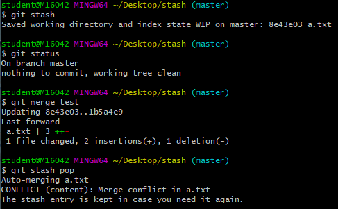

공간에 넣어놓고 merge,-> 그리고 다시 불러옴

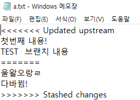

```bash
<<<<<<< Updated upstream
첫번째 내용!
TEST  브랜치 내용
=======
master 수정 중임..
다바뀜!
>>>>>>> Stashed changes
```

변경사항을 덮어 씌우지 않게끔


## reset vs revert

> commit 이력을 되돌리는 작업을 한다.

#### revert

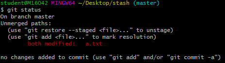

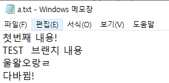

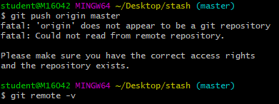

origin을 정해주지 않았어


stash 폴더 2개 복사해서 각각 revert reset

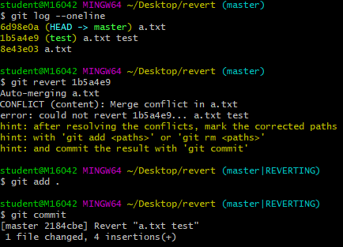

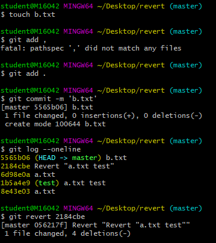

이력을 이 시점으로 돌아갔다 라는 이력을 남김

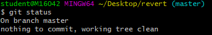

#### reset 

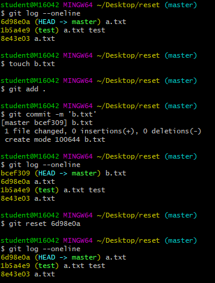

공개된 저장소에서 push한 이력이 있다면 절대 reset 쓰면 안돼

-> revert를 써서 돌아갔다라는 이력을 써야해

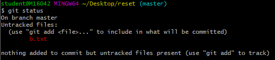


* `revert` : 되돌렸다는 이력을 남긴다

```bash
$ git log --oneline
5565b06 (HEAD -> master) b.txt
2184cbe Revert "a.txt test"
6d98e0a a.txt
1b5a4e9 (test) a.txt test
8e43e03 a.txt
```

```bash
$ git status
On branch master
nothing to commit, working tree clean
```


* `reset` : 이력을 삭제한다
  * `--mixed` : 기본 옵션, 해당 커밋 이후 변경사항 staging area에 보관
    * b.txt가 그대로 남아 있을 것이다
  * `--hard` : 해당 커밋 이후 변경사항 모두 삭제. **주의**
    * b.txt는 사라져 있을 것이다
  * `--soft` :  해당 커밋 이후 변경사항 및 working directory 내용까지 모두 보관

```bash
$ git log --oneline
6d98e0a (HEAD -> master) a.txt
1b5a4e9 (test) a.txt test
8e43e03 a.txt
```

```bash
$ git status
On branch master
Untracked files:
  (use "git add <file>..." to include in what will be committed)
        b.txt

nothing added to commit but untracked files present (use "git add" to track)
```

