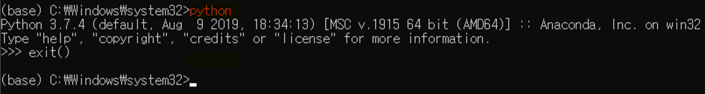

# python  설치

일반적인 프로그래밍 언어들은 나름대로의 특색이 있다

- C, C++, C# : C계열의 프로그래밍 언어
  - 효율성을 추구하는 언어
  - 수행속도, 메모리 사용용량 최적화 시키기 위해서 일반적으로 많이 사용
  - 생각보다 어려운 언어

- Java : 서버쪽 응용 프로그램을 만드는데 최적화
  - 가장 객체지향을 잘 반영하고 있는 언어

- JavaScript : 클라이언트쪽 응용 프로그램
  - Front - End Web Application

- Python : 프로그램을 쉽게 배워보아요
  - 자료구조, 데이터타입같은게 이해하기 쉽다
  - 자료구조를 이용해서 데이터 처리가 쉽다
    - => package가 추가되면서 데이터분석쪽에 강점을 가지기 시작한다

- 빠른시간내에 배울 수 있다
- 무료
- indent가 강제된다 (들여쓰기)
- 웬만한 프로그램 다 만들 수 있는데 시스템 프로그램(C계열)은 못해요

Mobile App은 만들 수 없어요

---

## 개발환경부터 세팅

* 두가지 방식이 있다
  * 일반적인 프로그래밍(웹 프로그래밍)
    * 파이썬을 설치하고 PyCharm을 설치해서 사용해서 (like Rstudio)
  * 데이터분석쪽
    * Python + jupyter notebook이라는 IDE를 사용
    * Anaconda라는 통합환경을 이용하면 편하다
    * Python은 3.x, 2.x 두가지 형태의 버전 호환성이 없다
    * anaconda3 을 받았는데 3.7을 기반으로 하고 있다

#### Anaconda

- 다운로드 next next.. default값으로

Anaconda를 설치했어요

pip라고 불리는 프로그램의 버젼을 최신버전으로 단 update시킬거야

anaconda prompt를 관리자 모드로 실행

python명령어 실행되는 거 확인

python -m pip install --upgrade pip

python pip실행해서 pip를 설치

우리가 코드를 작성하고 실행할 가상환경을 생성

(지금은 아나콘다의 base라는 환경에서 쓰고있음)

가상환경을 만들때 python버전을 3.6버전을 이용 ( 하나의 새로운 실행할 수 있는 환경, 컴퓨터)

conda create -n cpu_env python=3.6 openssl

(명령어) base말고 name이름을 지어주겠어   파이썬 버전은 3.6버전  ssl 모듈 같이

* 가상환경으로 전환해보아요
* base -> cpu_env  전환
* activate cpu_env
* IDE(통합개발환경)를 실행해야 한다
* jupyter notebook이라는 이름의 IDE를 사용
* Web 기반이 개발환경 -> browser를 이용해서 개발
* 이 jupyter notebook이 특정 가상환경을 기반으로 실행되어야 한다
* 내가 이 프로그램에서 작성한 코드를 어떤 가상환경에서 실행할것인지
  쉽게 정해서 사용할 수 있도록 프로그램에 package를 깔거야
* 이 jupyter notebook이 특정 가상환경을 이용해서 프로그램을 작성하고 실행할 수 있도록 도와주는 package를 하나 설치
* **conda install nb_conda**
* nb_conda라는 package 설치해

* 특정 가상환경에서 코드 실행가능하겠다
* jupyter notebook에서 코드를 작성하고 실행하기 위한 설정
* ipykernel을 설치하고 설정을 잡아야 한다

* python -m ipykernel install --user --name cpu_env --display-name=[CPU_ENV]
* ipykernel 설치하려고하는 것 / 유저 각각/이 이름의 가상환경에 대해서 ipykernel 설치한다
* [] : 눈에 보이는 이름 이렇게 설정할거야
* 가상환경을 삭제하고 싶을때 경로를 잘 알고 있어야해

* 제대로 됐는지 확인
* 현재 가상환경이 어떤게 설치되어 있는지 확인
* conda info --envs
* 만약에 가상환경을 삭제할 경우
* conda remove --name cpu_anv --all
* 실행한 후 남아있는 폴더는 수동으로 제거!!

---

#### IDE(jupyter notebook)를 실행시키기 위한 환경파일을 생성해 생성해 보아요

* Jupyter notebook --genderate-conig
* 저 폴더 내에 내가 파일 하나 만들어놨어

* 파일 만들어줌

* 오류나면 ctrl+c 계속 눌러줘

* 이렇게 뜰거야

셀이라고 하는 단위박스

* `#` : 주석

* 아래에 셀을 만들고 싶다 : b (below)
* 위에 셀을 만들고 싶다 : a (above)
* 실행은 셀단위로 실행된다
* 셀을 지우고 싶다 : dd
* 셀을 실행 : ctrl + enter : output 영역에 셀을 수행한 결과가 떨어짐
*  ( 이 output 영역을 안보고싶어 : o ) output 영역을 fog할 수 있어
* ipynb : ipython notebook

